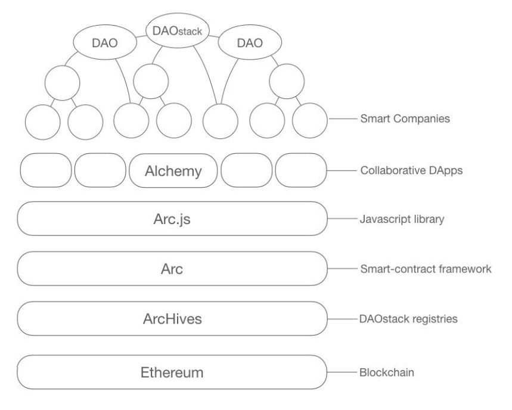

## An Overview of Arc

For more: [Read the whitepaper](https://github.com/daostack/daostack/blob/master/docs/DAOstack%20White%20Paper%20V1.0.pdf)

Arc is the lower layer of the DAOStack. It consists of several smart contracts deployed on the Ethereum blockchain that define the basic building blocks and standard components that can be used to implement any DAO.

The DAOStack:
1. [Ethereum](https://www.ethereum.org/) - *Base blockchain.*
2. ArcHives - *A public curated database of [element](#elements)s, organizations and a shared place for community collaboration*.
3. **Arc - This project**
4. [Arc.js](https://github.com/daostack/arc-js) - *Javascript library that talks to Arc, built on top of web3.js.*
5. [Alchemy](https://github.com/daostack/Alchemy-Aurelia) (and more...) - *Collaborative DApps, built on top of DAOStack using Arc.js*

### The Structure of a DAO

Each DAO consists of the following components:

* **[Native token](ref/controller/DAOToken.md)** - *A Standard [ERC20 token](https://theethereum.wiki/w/index.php/ERC20_Token_Standard) that defines the value system of the DAO, participants are rewarded for their contributions based on this token*.
* **[Reputation](ref/controller/Reputation.md) system** - *Similar to native token but is **non-transferable**, the reputation is used system is used to assign an importance to participants and their votes*.
* **[Avatar](ref/controller/Avatar.md)** - *This is the public facing part of the DAO that handles the interaction of the DAO with the rest of the world(interacing with other DAOs, paying third party participants, etc...)*.
* **Subscribed [Elements](#elements)** - *The set of [Schemes](ref/universalSchemes/UniversalSchemeInterface.md) and [Global Constraints](ref/globalConstraints/GlobalConstraintInterface.md) the DAO consists of*.

Those components are orginized in a single smart contract called a *[Controller](Controller)*.

## Elements

The main configurable and extendable building blocks of DAOs are: *Schemes* and *Global Constraints*, which are collectivley called *elements*.
* **[Schemes](ref/universalScheme/UniversalSchemeInterface.md)** *define the "do's" of the DAO, defining rules under which actions are taken, based on the participants input.* Examples of Schemes are:
    * Rewarding contributions if other participants recognize them as worthy.
    * Voting on proposals and automatically executing the chosen proposal.
* **[Global constraints](ref/globalConstraints/GlobalConstraintInterface.md)** *define the "don't" of the DAO, they define conditions that must always hold and can prevent an action from being taken if it violates these conditions.* Examples of Global Constraints are:
    * Limiting the amount of tokens or reputation that can be minted per day.
    * Blacklisting certain participants from performing certain actions.

### ArcHives and the Developer Ecosystem

#### Compendium

Developers can create and extend *elements* to define more rules that DAOs can subscribe to. 
Those *elements* can then be registered(for a fee) to a public database called *Compendium*.